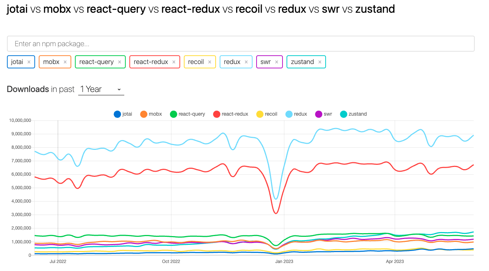
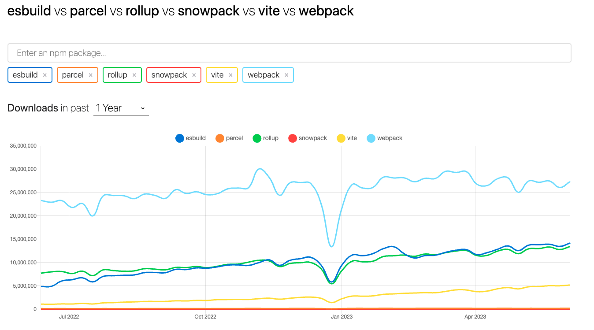
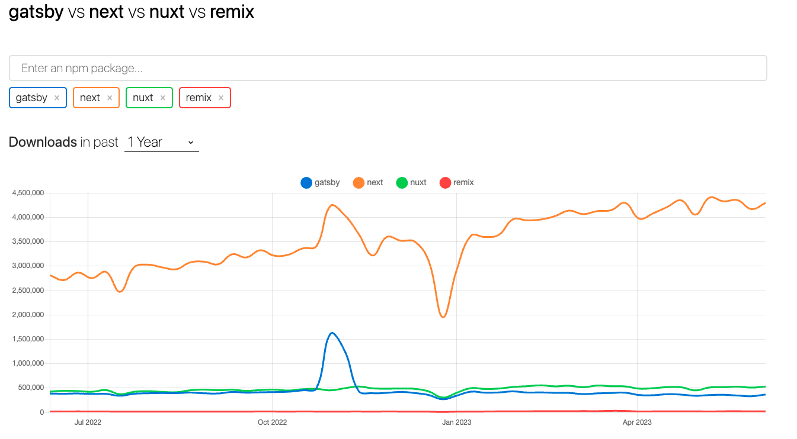

# react-setting
- CRA를 사용하지 않고 직접 셋팅 진행
- React + Typescript
<br/>
<br/>
<br/>

## 1. react, react-dom 설치
```
npm init -y
npm install react react-dom
```

## 2. webpack 설치
```
npm install --save-dev webpack webpack-bundle-analyzer webpack-cli webpack-dev-server webpack-merge webpack-remove-empty-scripts
```   
#### ※ webpack-bundle-analyzer   
- 번들에서 어떠한 파일이 얼마나 용량을 차지하는지 알 수 있음
- 각 파일 별 비중을 시각화(차트)하여 쉽게 파악할 수 있음
- 분석 결과를 토대로 꾸준히 개선/확인하는 것이 필요함!
- plugins에 실행 코드 추가 후, 빌드하면 dist 폴더(outDir) 내에 bundle-report.json 파일 생성됨.   
해당 파일이 있어야만 webpack-bundle-analyer 실행이 가능함! (먼저 빌드해야 함!!)
- https://github.com/webpack-contrib/webpack-bundle-analyzer
- https://satisfactoryplace.tistory.com/359


<br/>
<br/>
<br/>

## 3. module, loader 셋팅
```
// babel
npm install --save-dev @babel/cli @babel/core @babel/preset-env @babel/preset-react @babel/preset-typescript @babel/plugin-proposal-class-properties babel-loader core-js

// css
npm install --save-dev css-loader css-minimizer-webpack-plugin mini-css-extract-plugin style-loader sass sass-loader

// 그 외 plugin
npm install --save-dev html-webpack-plugin terser-webpack-plugin
```
<br/>

#### ※ css-minimizer-webpack-plugin
- css를 최적화하고 축소하는 역할을 하는 플러그인
- cssnano를 이용함
- https://webpack.js.org/plugins/css-minimizer-webpack-plugin/

<br/>

#### ※ mini-css-extract-plugin
- css를 별도의 파일로 추출함
- css를 포함하는 js 파일마다 css 파일을 생성함
- css 및 sourcemaps 의 on-demand 로딩을 지원함    
(on-demand 로딩: lazyloading, 요청이 있을 때 로드하는 것)
- https://webpack.js.org/plugins/mini-css-extract-plugin

<br/>

#### terser-webpack-plugin
- terser를 이용해 js 파일을 축소/최소화 하는 플러그인
- (terser) es6+를 위한 압축기(mangler/compressor) 툴킷, uglify-es에서 포크를 따 만듬
- webpack5는 최신 terser-webpack-plugin을 함께 제공하고 있으나,   
webpack5 이상의 버전을 사용하거나 옵션을 커스터마이징할 경우 plugin 설치해야 함

<br/>
<br/>
<br/>

## 4. Typescript 설치
```
npm install --save-dev @types/react @types/react-dom typescript
```

<br/>
<br/>
<br/>

## 5. Jest 설치 (ts-jest)
```
npm install --save-dev jest ts-jest @types/jest
```
- https://github.com/kulshekhar/ts-jest


<br/>
<br/>
<br/>

## 6. 프로젝트 구조
```
root
- config
    |
    -- webpack.common.js
    -- webpack.dev.js
    -- webpack.prod.js
- node_modules
- public
    |
    -- index.html
- src
    |
    -- App.tsx
    -- index.tsx
- .babelrc
- package.json
- tsconfig.json
- package-lock.json
```

<br/>
<br/>
<br/>

## 7. webpack 셋팅
- webpack-merge를 이용하여 webpack.dev.js, webpack.prod.js에 webpack.common.js를 병합함
- 개발 시 webpack-dev-server를 사용하고, 빌드 시 output 설정 등 모드에 따라 셋팅을 분리하여 관리할 수 있도록 구성함
- config 폴더 내 파일 참고

<br/>

#### ※ webpack.common.js

<br/>

##### ※ dist/js, dist/css 폴더 분리 필요할 때!
```
const RemoveEmptyScripts = require('webpack-remove-empty-scripts');
...
entry: {
    '/js/main': `${path.resolve(__dirname, '../src')}/ts/main.tsx`,
    '/css/main': `${path.resolve(__dirname, '../src')}/scss/main.scss`
},
plugins: [
    new RemoveEmptyScripts(),
    ...
]
```
- entry에서 key값으로 '폴더명/파일명' 설정한다.
- css의 경우 빈 js 파일도 생성되므로, 이를 지워주는 플러그인인 'RemoveEmptyScripts'를 설치하여 실행한다.
- 위와 같이 설정하였을 때, optimization.splitChunks.chunks: 'all' / 'initial'로 설정 시 react 및 라이브러리들은 별도 청크파일로 변환되고, src/ts 코드들은 entry에서 지정한 파일명으로 번들됨
- chunks: 'async'로 변경하면 하나의 파일로 번들됨

<br/>

##### ※ babel-loader만 사용하고, ts-loader를 사용하지 않는 이유?!
```
module: {
    rules: [
        {
            test: /\.(ts|tsx|js|jsx)$/,
            use: 'babel-loader',
            exclude: /node_modules/
        },
```
- babel7부터는 ts-loader가 필요없으며, babel이 typescript를 제거/처리함으로써 성능이 훨씬 빠르다고 함    
(단, transpile 용으로만, 타입 체크는 해주지 않음)   
- <b>단, @babel/preset-typescript 프리셋이 필요함 (타입 구문 인식 및 제거용)</b>
- <b>babel에서 타입 체크는 진행하지 않음(tsc에서 별도로 진행 필요)</b>   
```Keep in mind that Babel doesn't do type checking; you'll still have to install and use Flow or TypeScript to check types.```   
https://babeljs.io/docs/#type-annotations-flow-and-typescript
- ts-loader에서는 compiler 옵션을 통해 tsc로 compile한다고 함(타입체크 + emit(옵션 활성화 시))
- https://ui.toast.com/weekly-pick/ko_20181220
- https://victor-log.vercel.app/post/babel-loader-and-ts-loader-and-esbuild-loader/

<br/>

##### ※ plugin 설정 

```
plugins: [
    new MiniCssExtractPlugin(),
    new HtmlWebpackPlugin({
        template: 'public/index.html'
    }),
    // 모든 곳에서 모듈을 import/require 하지 않고 자동적으로 모듈을 로드하는 플러그인 
    new webpack.ProvidePlugin({ 
        React: 'react'
    }),
    // 
    new BundleAnalyzerPlugin({
        analyzerMode: 'static',
        openAnalyzer: false,
        generateStatsFile: true,
        statsFilename: 'bundle-report.json'
    })
],
```
- https://webpack.js.org/plugins/provide-plugin

<br/>

##### ※ 이미지 사용 시 src 폴더 구조대로 dist 폴더에 생성되도록 하는 방법
```
module: {
    rules: [
        ...
        {
            test: /\.(ico|png|jpe?g|gif|svg)$/,
            type: 'asset/resource',
            generator: {
                // img 폴더 바로 하위에 모든 파일이 들어옴
                //filename: 'img/[name][ext]' 

                // pathData에서 폴더 경로가 포함된 filename 추출하여 사용함
                filename(pathData) {
                    const { filename } = pathData || {};
                    return filename ? filename.replace('src', '') : filename;
                }
            }
        }
    ]
}
```

<br/>

#### ※ webpack.dev.js
```
devServer: {
    open: true,
    hot: true,
    compress: true, // gzip 압축 활성화
    port: 8080,
    historyApiFallback: true, // html5 history api 사용 시, 404 대신 index.html을 바라보도록 설정
    liveReload: true
}
```
- https://webpack.kr/configuration/dev-server/ 
- https://github.com/bripkens/connect-history-api-fallback


<br/>

#### ※ webpack.prod.js
```
optimization: {
    usedExports: true, // 사용하지 않는 export 제거
    minimize: true, // 번들 최소화 (terser plugin 또는 minimizer에 지정된 플러그인 사용함)
    minimizer: [ // 번들 최소화 도구 지정
        new TerserPlugin({
            terserOptions: {
                compress: {
                    drop_console: true
                }
            },
            extractComments: true // 주석을 모아 LICENSE.txt 파일 생성함
        }),
        new CssMinimizerPlugin()
    ],
    splitChunks: { // 동적으로 가져온 모듈에 청크 전략을 사용할 수 있음
        chunks: 'all' // all: 모든 유형의 청크 포함(비동기 청크와 동기 청크 간에도 청크 공유 가능)
    }
}
```
- https://webpack.kr/configuration/optimization

<br/>
<br/>
<br/>

## 8. babel 셋팅
```
{
    "presets": [
        "@babel/preset-react",
        [
            "@babel/preset-env",
            {
                "modules": false,
                "useBuiltIns": "usage",
                "corejs": 3
            }
        ],
        "@babel/preset-typescript"
    ]
}
```
- (@babel/preset-react) react의 jsx 구문 인식 및 transfiling 하기 위해 사용
- (@babel/preset-env) 
    - babel7부터는 필수 preset   
    - 최신 자바스크립트를 사용하면 타겟 브라우저/환경에 맞춰 transfiling 해줌
    - babel-preset-es2015 -> babel-preset-env로 변경됨
    - (modules) 모듈 구문을 다른 모듈 타입으로 변환할 수 있음    
    (amd/umd/systemjs/commonjs/cjs/auto(default)/false: 사용하던 모듈이 보존됨)
    - (useBuiltIns) 폴리필 처리 방법을 구성함   
    usage/entry 옵션은 core-js를 직접 참조하므로 core-js에 접근할 수 있어야 한다(core-js 설치 필요)
    - https://babeljs.io/docs/env
    - https://babeljs.io/docs/babel-preset-env

<br/>
<br/>
<br/>

## 9. tsconfig.json 셋팅
```
// tsconfig.json 생성 (직접 생성도 가능)
npx tsc --init

// tsconfig.json 구성
```

- tsc(typescript compile) 할 때, js 파일 제공 없이 .d.ts 파일만 생성하고 싶을 때
    ```
        "declaration": true,
        "declarationDir": "./dist/types",
        "emitDeclarationOnly": true, // .d.ts 만 내보내는 옵션
        "noEmit": false, // js 파일 내보내지 않으려면 true를 해야하지만, declaration 뽑으려면 false로 해야 함
    ```

<br/>
<br/>
※ moduleResolution
https://www.typescriptlang.org/tsconfig#moduleResolution

- node16 / nodeNext: 해당 값으로 선언 시, ouput JS에서 모듈을 가져와 결합할 때 import/require로 가져오는지에 따라 알맞은 알고리즘을 선택할 수 있도록 함   
  (node12부터는 다른 알고리즘으로 가져오기를 진행하는 ECMAScript의 import, CommonJS의 require 둘다 지원함)
- node10: CommonJS만 지원함
- bundler: 번들러 사용을 위한 옵션. import/require 둘다 지원하지만, node16/nodenext와 달리  import/reuqire로 가져오는 상대경로에 파일 확장자를 요구하지 않음
- classic: 이제 사용 지양함

<br/>
<br/>
<br/>

## 10. jest 셋팅
```
npx ts-jest config:init
```
- jest.config.js 생성
- https://github.com/kulshekhar/ts-jest


<br/>
<br/>
<br/>

## 11. package.json scripts 추가
```
{
    ...
    scripts: {
        "dev": "webpack-dev-server --config config/webpack.dev.js",
        "build": "webpack --config config/webpack.prod.js",
        "tsc": "tsc",
        "test": "jest",
        "analyze": "webpack-bundle-analyzer ./dist/bundle-report.json --default-sizes gzip"
    }
}
```

<br/>
<br/>
<br/>

## 12. index.html 생성 및 코드 작성
- public/index.html 참고

<br/>
<br/>
<br/>

## 13. index.tsx, App.tsx 생성 및 코드 작성

#### ※ index.tsx - DOM에 엘리먼트 렌더링하는 코드 작성   
```
import { createRoot } from 'react-dom/client';
import App from './App';

const container = document.getElementById('root');
const root = createRoot(container as Element);

root.render(<App />);
```
- ReactDOM.createRoot 타입 이슈 발생 -> createRoot는 react-dom/client 내에 위치함   
(client.d.ts 연결하거나 지금처럼 createRoot 추출해서 사용하기)
- https://ko.reactjs.org/docs/rendering-elements.html
- https://github.com/DefinitelyTyped/DefinitelyTyped/issues/43848


<br/>
<br/>
<br/>

# 참고
### CRA 없이 React 셋팅하는 법
- https://medium.com/@JedaiSaboteur/creating-a-react-app-from-scratch-f3c693b84658
- https://ryuhojin.tistory.com/19

<br/>
<br/>
<br/>

# 기술 동향
## ▶︎ 상태관리 라이브러리
### NPM Trend
https://npmtrends.com/jotai-vs-mobx-vs-react-query-vs-react-redux-vs-recoil-vs-redux-vs-swr-vs-zustand



<br/>
<br/>

### redux / react-redux

### (1) redux
https://ko.redux.js.org/introduction/getting-started

<br/>

#### redux란?
- "전역" 상태를 포함하는 단일 스토어
- 앱에 어떤 일이 일어날 때 스토어에 일반 객체 액션을 디스패치하는 것
- 액션을 살펴보고 불변성을 유지한 채 업데이트된 상태를 반환하는 순수 리듀서 함수
- 필수는 아니지만, 아래의 항목들을 포함한다.
    - 액션 객체를 생성하는 액션 생성자
    - 부수 효과를 가능하게 하는 미들웨어
    - 부수 효과를 가진 동기 또는 비동기 로직을 포함하는 Thunk 함수
    - ID로 항목 조회를 가능하게 하는 정규화된 상태
    - Reselect 라이브러리를 사용하여 파생된 데이터를 최적화하는 메모이제이션된 셀렉터 함수
    - 액션의 이력과 상태 변경을 확인할 수 있는 Redux DevTools 확장 프로그램
    - 액션, 상태 및 기타 함수에 대한 TypeScript 타입
- redux는 보통 react-redux 라이브러리와 함께 사용되어 React 컴포넌트가 Redux 스토어와 상호 작용할 수 있게 함
- redux toolkit(@reduxjs/toolkit) 패키지는 코어 redux 패키지 및 redux앱을 만드는데 필수적인 API 메서드와 공통 의존성을 포함함. redux에서 공식적으로 추천하는 방법임

<br/>

#### redux 사용하면 좋은 케이스
- 앱에서 많은 장소에 많은 양의 상태값이 필요함
- 앱 상태가 자주 업데이트 함
- 상태를 업데이트하는 로직이 복잡함
- 앱의 코드양이 중간/큰 사이즈이며, 많은 사람들이 함께 일함
- 시간이 지남에 따라 해당 상태가 어떻게 업데이트되는지 확인해야 함

<br/>

※ redux와 비슷한 다른 툴들도 많기 때문에, 개발하는 앱이 redux를 사용했을 때의 이점이 있다면 사용하자.

<br/>

#### redux 콘셉

<br/>


<br/>
<br/>

### mobx

https://ko.mobx.js.org/README.html

<br/>

#### mobx 개념
- 상태(state): 상태(state)를 정의하고 관찰가능하게(observable) 만들기
    - state 생성 후 Mobx가 추적할 수 있도록 observable 표시하기
    - observable 표시한 state는 값을 직접 변경 가능(mutable) (redux는 immutable)
- 동작(action): action은 사용자 이벤트, 백엔드 데이터 푸시, 예약된 이벤트 등 state를 변경하는 코드
    - observable을 변경하는 코드는 action으로 표시하는 것이 좋음    
    -> Mobx가 트랜잭션을 자동으로 적용하여 성능을 쉽게 최적화할 수 있어서 
- 파생(derivation):  computed / reaction
    - computed: 현재의 observable state에서 순수 함수를 사용하여 파생될 수 있는 값
    - reaction: state가 변경될 때 자도으로 발생해야 하는 부수효과
    - reaction을 과도하게 사용하지 말고, state 기반으로 값을 생성하려고 할 때 computed를 사용하기

※ observer가 있으며, observable을 걸어둔 state가 변경되면 해당 action을 실행함 

<br/>

#### mobx 스토어
- 스토어는 컴포넌트 로직과 state를 프론트/백엔드에서 사용할 수 있고 독립적으로 테스트할 수 있는 단위로 만들어야 함
- 다중 스토어 지원함: 앱에서 두 개의 저장소(도메인 state 저장소와 UI state 저장소) 이상 있으면 좋겠다고 명시함   
-> 분리함으로서 재사용 및 테스트 할 수 있고, 도메인 state 저장소의 경우 다른 앱에서 재사용할 수 있음
- 도메인 스토어
    - 앱에 도메인 스토어가 하나 이상 존재할 가능성이 높음
    - 하나의 도메인 스토어는 종종 여러 도메인 객체가 내부에 있는 트리 구조로 구성됨
    - 하나의 도메인 스토어는 앱에서 하나의 개념을 담당해야 함
- UI 스토어
    - UI에 대한 많은 정보 저장함
    - 아래의 항목들은 일반적으로 UI 스토어에 저장함   

    ```
    세션 정보
    애플리케이션이 로드된 정도에 대한 정보
    백엔드에 저장되지 않을 정보
    UI에 전체적으로 영향을 미치는 정보
    Window dimensions
    접근성 정보(Accessibility information)
    현재 사용 중인 언어(Current language)
    현재 활성 중인 테마(Currently active theme)
    관련 없는 여러 컴포넌트에 영향을 미치는 유저 인터페이스 state
    현재 선택 항목(Current selection)
    툴바 가시성(Visibility of toolbars)
    위저드(wizard) state
    전역 오버레이(global overlay) state
    ```
- 스토어 결합: 모든 저장소를 인스턴화하고 참조를 공유하는 RootStore 만들기

<br/>
<br/>

### react-query
- react-query는 주로 웹 애플리케이션에서 API 호출, 데이터 캐싱, 상태 관리 등을 데이터 관리를 용이하게 함
- React의 상태 관리 기능과 함께 사용할 수 있으며, 다른 상태 관리 라이브러리와도 호환됨
- 특징
    - 쿼리(Query)   
    쿼리는 서버에서 데이터를 가져오는 요청을 나타내는 개념   
    react-query는 RESTful API, GraphQL, WebSocket 등 다양한 종류의 쿼리를 지원함. 각 쿼리는 고유한 키로 식별되며, 데이터의 상태와 관련된 정보를 제공함
    - 뮤테이션(Mutation)   
    서버에 데이터를 변경하는 요청. 데이터의 생성, 업데이트, 삭제 등 다양한 종류의 뮤테이션을 지원함.    뮤테이션은 비동기로 실행되며, 성공 또는 실패와 같은 상태 정보를 제공
    - 캐싱(Caching)   
    서버에서 가져온 데이터를 자동으로 캐싱하여 성능을 향상시킴. 데이터는 메모리에 저장되며, 쿼리의 키를 기반으로 캐시됨. 캐시된 데이터는 이후에 재사용되어 동일한 요청을 다시 보내지 않고 빠르게 렌더링할 수 있음.
    - 자동 리패칭(Automatic Refetching)   
    캐시된 데이터를 자동으로 다시 가져오는 기능을 제공함. 설정된 간격 또는 특정 이벤트(예: 다른 뮤테이션의 성공)에 따라 쿼리를 자동으로 리패칭할 수 있으며, 이를 통해 데이터가 항상 최신 상태를 유지할 수 있음
    - 인터셉터(Interceptor)   
    요청 및 응답에 대한 인터셉터를 제공하여 로딩 상태, 에러 처리, 캐싱 전략 등을 사용자 정의할 수 있음. 이를 통해 특정 상황에 맞게 데이터 요청을 조작하거나 전처리할 수 있음

<br/>

※ react-query로만 전역 상태관리가 가능한가?? (chatGPT)   
```
React Query는 주로 데이터 관리와 API 호출에 사용되는 라이브러리이지만, 전역 상태 관리를 위해서도 사용할 수 있습니다. React Query의 Query 및 Mutation 상태는 컴포넌트 간에 공유될 수 있으며, 이를 활용하여 전역 상태를 관리할 수 있습니다.

React Query에서 전역 상태를 관리하는 방법은 다음과 같습니다:

React Query의 Query 상태 활용: React Query의 Query 컴포넌트를 사용하여 전역 상태를 가져올 수 있습니다. Query 컴포넌트를 사용하면 전역 상태를 사용하는 모든 컴포넌트가 해당 상태에 대한 구독을 자동으로 처리합니다. 이를 통해 상태가 변경될 때 컴포넌트가 자동으로 업데이트됩니다.

Query 캐싱: React Query는 데이터 캐싱 기능을 제공하여 가져온 데이터를 자동으로 저장하고 재사용할 수 있습니다. 이를 통해 전역 상태를 효과적으로 관리할 수 있습니다. 데이터를 한 번 가져오면 해당 데이터를 다른 컴포넌트에서도 사용할 수 있으며, 데이터가 변경될 때까지 다시 가져오지 않습니다.

Mutate 함수를 통한 상태 업데이트: React Query의 Mutate 함수를 사용하여 전역 상태를 업데이트할 수 있습니다. Mutate 함수를 호출하면 React Query는 해당 상태를 업데이트하고 관련된 컴포넌트들에게 자동으로 변경을 알립니다. 이를 통해 전역 상태의 변경이 필요한 곳에서 쉽게 업데이트할 수 있습니다.

또한, React Query의 Query Keys를 활용하면 다양한 상태를 구분하고 전역 상태를 효과적으로 관리할 수 있습니다. Query Keys를 사용하여 각각의 상태에 대한 쿼리를 정의하고 사용자 지정 로직에 따라 상태를 업데이트할 수 있습니다.

그러나 React Query는 주로 데이터 관리를 위해 설계되었으므로, 좀 더 복잡한 전역 상태 관리가 필요한 경우에는 다른 전용 전역 상태 관리 라이브러리인 Redux, Zustand, MobX 등을 고려해 볼 수도 있습니다. 이러한 라이브러리들은 전역 상태 관리에 특화되어 있으며, 더 복잡한 상태 관리 요구 사항을 처리할 수 있습니다.
```

<br/>
<br/>

※ react-query로만 전역 상태관리가 가능한가?? (찾아본 내용)


<br/>
<br/>

### zustand
- zustand는 React 애플리케이션의 상태 관리를 간편하게 해주는 작은 크기의 상태 관리 라이브러리임
- 단순한 상태 관리 라이브러리이기 때문에 작은 규모의 프로젝트나 간단한 컴포넌트에서 유용함   
복잡한 상태 관리와 비동기 작업을 다루어야 할 때는 Redux나 React Query와 같은 더 강력한 상태 관리 라이브러리를 고려하는 것이 좋음
- 특징
    - 간결하고 직관적인 API   
    상태와 상태를 변경하는 액션을 정의하는 방식으로 상태 관리를 수행함
    - 불변성을 유지하지 않음   
    일반적인 상태 관리 라이브러리와 달리 불변성을 유지할 필요가 없음. 
    상태를 직접 수정할 수 있으며, 이로 인해 간결하고 간단한 코드 작성이 가능함
    - React Hooks와 함께 사용   
    useState와 비슷한 형태로 상태를 정의하고, 상태 변경을 위해 useStore와 같은 훅을 사용할 수 있음
    - 작은 크기와 높은 성능   
    zustand는 작은 크기로 유지되며, 상태 변경 감지와 렌더링 최적화를 위한 내부 메커니즘을 가지고 있어 높은 성능을 제공함
    - Middleware 지원   
    Redux와 유사한 방식으로 미들웨어를 지원함. 미들웨어를 사용하여 상태 변경을 가로채고 처리할 수 있으며, 비동기 작업이나 로깅과 같은 추가 기능을 쉽게 구현할 수 있음
    - React의 Context API와 함께 사용   
    React의 Context API를 기반으로 작동함. 이를 통해 애플리케이션의 상위에서 상태를 관리하고 하위 컴포넌트에 제공할 수 있음

<br/>
<br/>

### swr
- swr(Stale-While-Revalidate)은 Next.js 팀에서 개발한 JavaScript 라이브러리로, React 애플리케이션의 데이터 관리를 위해 사용됨
- React 애플리케이션의 데이터 요청과 캐싱, 자동 리패칭 등을 간편하게 처리하기 위해 SWR을 사용함
- SWR은 주로 REST API 호출을 다루는데 사용되지만, GraphQL과도 함께 사용할 수 있음
- 특징   
    - 데이터 요청과 캐싱   
    SWR은 데이터 요청을 처리하고 가져온 데이터를 자동으로 캐싱함. 첫 번째 요청 시에는 데이터를 서버에서 가져와 애플리케이션에 표시하고, 이후에는 캐시된 데이터를 사용하여 빠르게 표시함
    - 자동 리패칭   
    SWR은 데이터의 상태 변화를 감지하고 필요한 경우에만 자동으로 리패치함. 이를 통해 데이터가 변경되었을 때 즉시 업데이트되며, 캐시된 데이터와 서버의 데이터를 비교하여 최신 데이터로 업데이트함
    - 로컬 캐시   
    클라이언트 측에 로컬 캐시를 사용하여 데이터를 저장함. 이를 통해 페이지 전환 시에도 이전에 가져온 데이터를 재사용할 수 있음.
    - 유효성 검사   
    유효성 검사를 통해 캐시된 데이터의 유효성을 확인. 기본적으로 일정 시간이 경과하면 데이터를 다시 가져옴. 이는 "Stale-While-Revalidate" 전략을 사용하여 캐시된 데이터를 사용하면서도 서버로부터 최신 데이터를 가져오는 방식.
    - 에러 핸들링   
    SWR은 서버에서의 데이터 요청에 대한 에러 처리를 간편하게 지원함. 에러가 발생하면 SWR은 에러 상태를 관리하고 해당 에러를 처리할 수 있는 기능을 제공

<br/>
<br/>

※ react-query와 swr의 차이점 (chatGPT)
```
개발 팀: React Query는 Tanner Linsley가 개발한 라이브러리이며, SWR은 Next.js 팀에서 개발한 라이브러리입니다. 두 라이브러리는 다른 개발자 및 팀에 의해 관리되고 유지보수되고 있습니다.

기능: React Query는 데이터 관리, API 호출, 상태 관리 등을 다양한 기능을 제공하는 포괄적인 라이브러리입니다. 반면에 SWR은 데이터 요청, 캐싱, 자동 리패칭 등을 중점으로 한 라이브러리입니다. React Query는 GraphQL과도 함께 사용할 수 있는 반면, SWR은 REST API와 GraphQL 모두를 다룰 수 있습니다.

캐싱 전략: React Query는 데이터 캐싱을 위해 캐시 키에 기반한 자체적인 캐싱 전략을 사용합니다. 이를 통해 데이터를 캐싱하고 업데이트할 수 있습니다. SWR은 "Stale-While-Revalidate" 전략을 사용하여 데이터를 가져오고 캐시하며, 캐시된 데이터를 사용하면서도 필요한 경우에는 서버로부터 최신 데이터를 가져옵니다.

통신 방식: React Query는 axios, fetch 등과 같은 비동기 통신 라이브러리와 통합하여 데이터 요청을 처리합니다. SWR은 내부적으로 fetch API를 사용하여 데이터 요청을 처리합니다.

생태계: React Query는 다양한 기능과 확장성을 제공하는 전체적인 데이터 관리 솔루션입니다. React Query Devtools와 같은 개발자 도구, React Native 및 Vue.js와 같은 다른 프레임워크와의 통합도 지원합니다. SWR은 Next.js와 밀접하게 통합되어 다양한 Next.js 기능과 함께 사용하기 용이합니다.
```


<br/>
<br/>

## ▶︎ 번들러
### NPM Trend
https://npmtrends.com/esbuild-vs-parcel-vs-rollup-vs-snowpack-vs-vite-vs-webpack



<br/>
<br/>

## ▶︎ SSR 지원 프레임워크
### NPM Trend
https://npmtrends.com/gatsby-vs-next-vs-nuxt-vs-remix



<br/>
<br/>
<br/>
